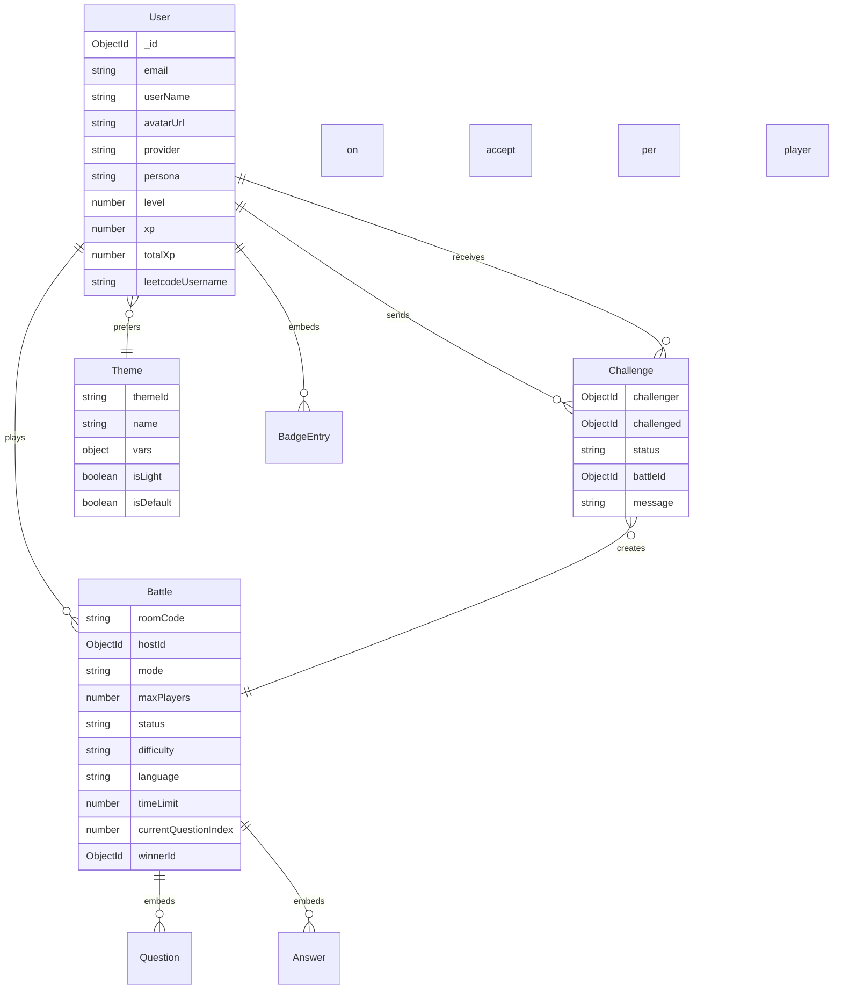

# DevArena — Project Specification (as built)

> **Status:** Implemented and working (backend + frontend)
> **Last updated:** 2026-09-13
> **How to read this doc:** written for beginners. Jargon is explained the
> first time it appears. Code examples are short on purpose.

---

## 1. What is DevArena?

DevArena turns your real developer activity into a game:

1. **Sign in** with GitHub or Google.
2. **Analyze** your GitHub — DevArena stores your repos, languages, streaks.
3. Get your **Developer DNA** (a persona like "The Builder", computed by fixed rules).
4. Enter the **Arena**, battle other developers in live quiz + coding duels.
5. Earn **XP, levels, wins** and climb the **Leaderboard**.
6. Revisit your year in **Wrapped**, share your public profile `/u/:username`.

**Tech stack**

| Part | Technology |
|---|---|
| Backend | Node.js, Express 5, TypeScript, Mongoose (MongoDB), Passport (OAuth), express-session, Zod (validation), Socket.IO |
| Frontend | React 19, TypeScript, Vite, Tailwind CSS, Zustand, Axios, Socket.IO client, Recharts, Framer Motion |
| Code execution | Judge0 CE public API (no key; self-host URL configurable) |
| Auth | Session cookies (Passport). **No JWT, no localStorage tokens.** |

**Repo map**

```text
backend/src/
├── config/        env.ts (validated env vars), db.ts, passport.ts
├── models/        user, battle, challenge, theme (MongoDB schemas)
├── controllers/   one file per feature (request handling)
├── services/      reusable logic (GitHub, LeetCode, DNA, questions, execution, stats, seeds)
├── routes/        URL → controller wiring
├── sockets/       Socket.IO events (presence + battle refresh pings)
├── middlewares/   requireAuth, global responses, validation
└── server.ts      app setup, route mounting, boot jobs

frontend/src/
├── pages/         one screen per route (Dashboard, ArenaLobby, BattleRoom, …)
├── services/      typed API clients (one per backend feature)
├── store/         Zustand stores (auth, app cache, theme)
├── app/           routes, route guards, Socket/Auth providers
└── components/    UI pieces (leetcode, wrapped, profile, challenges, effects)
```

**Run it**

```bash
# backend
pnpm install && pnpm dev        # needs .env: MONGODB_URI, FRONTEND_URL, SESSION_SECRET (32+ chars),
                                # GITHUB_*/GOOGLE_* OAuth keys + callbacks. Optional: JUDGE0_API_URL

# frontend
pnpm install && pnpm dev        # needs .env: VITE_BACKEND_URL=http://localhost:2001/api/v1
```

Typecheck/build: frontend `pnpm typecheck`, `pnpm build`; backend `pnpm typecheck`, `pnpm build`.

---

## 2. Five big ideas (read this first)

1. **Session auth.** Login sets an `httpOnly` cookie. The browser sends it
   automatically; JavaScript never sees a token. `requireAuth` middleware
   rejects requests without a session.
2. **The server is always right.** Scores, winners, XP, ranks, personas and
   leaderboard order are computed on the backend from data it trusts
   (MongoDB + official APIs). The frontend only sends *actions*
   ("I pick option B", "run this code") — never results.
3. **Cache, then read.** GitHub/LeetCode data is fetched from official APIs,
   normalized, and saved on your User document. Pages read the *stored copy*,
   so they are fast and work even if GitHub is down. Re-syncs are cached
   (15 minutes) to respect rate limits.
4. **Battles move together.** Everyone in a room sees the same question at
   the same time. Only the host advances the room (by *locking*).
5. **Public means safe.** Public endpoints (`/u/:username`, shared results,
   leaderboard) only ever expose fields that are safe to share — never email
   (unless you opt in), tokens, answer keys, hidden tests, or other players'
   code.

**Response shape.** Every API answer looks like this:

```json
// success
{ "success": true, "message": "Battle room", "data": { "...": "..." } }
// error
{ "success": false, "message": "Room not found" }
```

All `POST`/`PATCH` bodies are validated with Zod; bad input returns `400`
with a human-readable message.

---

## 3. Database schemas

MongoDB stores four collections. (There are **no** separate Badge, XP-log or
Question collections — badges live inside the user, questions live inside
the battle that uses them.)

### 3.1 ER diagram



How to read it: `User ||--o{ Battle` means "one user can appear in many
battles" (via `players[].userId`). Boxes embedded *inside* a document
(questions, answers, badges) are stored together with their parent — one
read gets everything. `settings.themeId` points at a theme logically (no
database-level foreign key).

### 3.2 User — the heart of the app

One document per developer:

- **Identity:** `email`, `userName`, `avatarUrl`, `provider`
  (`github`/`google`), `providerAccountId`, `githubId`, `googleId`,
  `accessToken`/`refreshToken` (OAuth secrets — **never sent to clients**;
  `toPublicUser()` strips them from every response).
- **Persona:** `persona` (e.g. `"The Builder"`), `personaReason`.
- **Progression:** `level`, `xp`, `totalXp` (both accumulate lifetime XP;
  `level` derives from `totalXp`), `rank`.
- **`githubStats`** — cached GitHub intelligence: repo/follower/star/fork
  counts, `totalCommits`, `languages` (language → bytes),
  `topLanguage`, `contributionStreak`, `longestStreak`,
  `mostActiveRepos` (top 5 by your commits), `codingConsistency`,
  `openSourceScore`, `activityCalendar` (per-day pushes with repo names and
  sample commit messages for heatmap hovers), `lastSyncedAt`.
- **`battleStats`** — `totalBattles`, `wins`, `losses`, `draws`,
  `winStreak`, `bestWinStreak`, `avgScore`, `favoriteLanguage`. Written only
  by the server when battles finish (see section 11).
- **`badges`** — array of `{ badgeId, earnedAt, tier }`
  (tier: bronze → diamond).
- **`settings`** — `publicProfile`, `showEmail`, `notifications`,
  `theme` (legacy dark/light/system), **`themeId`** (e.g. `"neon"` — must
  exist in the Theme collection), `allowChallenges`.
- **`leetcodeUsername` + `leetcodeStats`** — cached LeetCode profile:
  ranking, solved counts (total/easy/medium/hard), contest rating/ranking,
  contests attended, top %, contest badge, top languages, skill tags,
  badges, recent solves, `dailySolved` (365-day per-day counts with problem
  titles), active days, streak, `lastSyncedAt`.
- **`presence`** — `isOnline`, `lastSeenAt`, `socketConnectedAt`
  (maintained by Socket.IO; see section 12).
- `lastActiveAt`, `joinedAt`, plus `createdAt`/`updatedAt`.

Helpful indexes: `xp`, `battleStats.wins`, `githubStats.totalCommits`,
`presence.isOnline`.

### 3.3 Battle — one competitive room

- `roomCode` — 6-char join code (unique). `hostId` — the creator, who
  controls progression. `mode` (`1v1`/`royale`), `maxPlayers`.
- `status` — `waiting` → `active` → `finished`.
- `difficulty`, `language`, `timeLimit` (seconds, 30–600).
- **`currentQuestionIndex`** — the room's shared pointer. Everyone sees
  `questions[currentQuestionIndex]`. Only the host's *lock* moves it.
- **`questions[]`** — embedded. Quiz questions: `prompt`, `options`,
  `correctAnswer`, `explanation`, `code`, `tags`, `xpValue`. Coding
  questions (`type: "coding"`): `statement`, `inputDescription`,
  `outputDescription`, `constraints`, `examples` (visible tests),
  **`hiddenTests`** (server-only until the battle ends), `starterCode`.
  Every battle = 3 quiz + 2 coding questions (deterministic per difficulty).
- **`players[]`** — per developer: `userId`, `score`,
  `answers[]` (finalized, one per locked question),
  `pendingSelection` (changeable quiz pick for the current question),
  `pendingCode` (changeable code + language + last visible-test run).
- **Answer record** — `questionId`, `type` (`mcq`/`coding`), `answer`,
  `isCorrect`, **`pointsEarned`**, `timeTaken`, `submittedAt`, plus coding
  detail: `code`, `language`, `testsPassed`, `testsTotal`, `testResults[]`
  (per-test pass/fail in evaluation order), `executionTimeMs`, `memoryKb`,
  `error`.
- `startedAt`, `endedAt`, `winnerId` (null = draw).

### 3.4 Challenge — a battle invitation

`challenger` → User, `challenged` → User, `status`
(`pending`/`accepted`/`declined`/`expired`/`cancelled`), `battleId`
(filled on accept — challenges reuse the Arena, they never create a second
battle system), `settings` (difficulty/language/timeLimit), optional
`message` (280 chars), `expiresAt` (10 minutes), `respondedAt`.

### 3.5 Theme — UI skins in the database

`themeId` (e.g. `"midnight"`), `name`, `description`, `vars` (13 hex
colors: bg, surfaces, borders, text levels, primary, secondary, accent,
shadow), `isLight` (sets the browser `color-scheme`), `isDefault`,
`sortOrder`. 12 themes ship as seed data (inserted only if missing, so
direct DB edits survive restarts).

---

## 4. Controllers (what each file does)

| File | Job |
|---|---|
| `auth.controller` | `GET /me` (session user), `POST /logout` (destroys session + cookie) |
| `user.controller` | Own profile, settings update (validates `themeId` exists), public profile (privacy-filtered) |
| `github.controller` | Sync + read cached GitHub stats (15-min cache) |
| `leetcode.controller` | Connect (username → fetch → store), sync (cached), disconnect (reset) |
| `dna.controller` | Compute + persist persona from stored GitHub stats |
| `dashboard.controller` | One aggregated payload: user + last 5 finished battles + badges + top repos |
| `arena.controller` | All battle logic: rooms, selections, host lock, code save/run, forfeit, history, details |
| `challenge.controller` | Create/list/accept/decline/cancel challenges (+ expiry sweeper, socket pings) |
| `developers.controller` | Online presence for a username (online flag only) |
| `leaderboard.controller` | Public paginated ranking + your rank |
| `theme.controller` | Public theme gallery |
| `wrapped.controller` | Personal + public season recaps computed from Battles + stored stats |

Supporting services: `github.service` (fetch + normalize), `leetcode.service`
(GraphQL + normalize), `dna.service` (deterministic persona rules),
`battle-questions.service` (quiz bank + 3 coding problems + builder),
`code-execution.service` (Judge0 runs + strict grading rule),
`battle-stats.service` (XP/battleStats writes + backfill), `theme-seeds`
(12 themes). Sockets (`sockets/index.ts`) handle presence and
`battle:updated` refresh pings — game facts always travel over REST.

---

## 5. How GitHub data is fetched and stored (beginner walkthrough)

Think of it like a librarian copying your public library card, then filing
the copy so the app never has to call the library again.

**When does it run?**

- Automatically right after GitHub OAuth callback (`syncGitHubUser`).
- Manually via `POST /api/v1/users/me/sync-github` (the Dashboard button).
- Skipped when the last sync is under 15 minutes old ("up to date").

**Step by step** (`github.service.ts` → saved onto `user.githubStats`):

1. **Who are you?** `GET /user` with your OAuth token → login, avatar,
   public repo count, followers. (401 = "sign in with GitHub again";
   403 = "rate limit, try later".)
2. **Your repos + recent activity in parallel:**
   `GET /user/repos?affiliation=owner,collaborator,organization_member`
   (all pages via the `Link` header) and
   `GET /users/:login/events/public` (your recent public actions).
3. **Languages:** for repos you own (not forks), call
   `GET /repos/:owner/:repo/languages` (5 at a time) and add up the bytes
   per language → `languages` map + `topLanguage`.
4. **Commits per repo:** `GET .../commits?author=you&per_page=1` and read the
   total from the `Link: rel="last"` page number (4 at a time) — a cheap
   counting trick, no downloading. Top 5 become `mostActiveRepos`.
5. **Streaks:** from `PushEvent` days in your events → current streak
   (counts back from today), longest streak, consistency
   (% of the last 90 days active).
6. **Activity calendar:** groups pushes by day with repo names + up to 3
   commit-message first lines (capped: 6 repos/day) — powers the heatmap.
7. **Scores:** `openSourceScore` (repos×3 + followers capped at 40 + stars
   capped at 30, max 100).
8. Save everything + `lastSyncedAt` on your User. Your `userName` is
   refreshed from GitHub login too.

Only **your own token** can do this (`provider === "github"` + stored
`accessToken` required). Other users' profiles show the cached copy.

## 6. How LeetCode data is fetched and stored

Same cache-then-read idea, but simpler — LeetCode needs no login, just a
public username:

1. **Connect:** `PUT /api/v1/users/me/leetcode { "username" }`. The name
   must match `/^[\w-]{1,30}$/`.
2. **Fetch:** one `POST https://leetcode.com/graphql` asking for
   `matchedUser` (ranking, accepted counts by difficulty, languages, skill
   tags, calendar, badges), `userContestRanking`, and the last 20 accepted
   submissions.
3. **Normalize:** solved totals, contest stats, top 10 languages, top 12
   skill tags/badges, and `dailySolved` — the calendar's
   `{unixTimestamp: count}` entries trimmed to 365 days, each day enriched
   with known problem titles from recent submissions (for heatmap hovers).
4. **Store** on `user.leetcodeUsername` + `user.leetcodeStats` with
   `lastSyncedAt`. Refresh via `POST .../leetcode/sync` (15-min cache);
   `DELETE .../leetcode` clears both fields.

If the username doesn't exist you get `404 "No public LeetCode profile…"`;
if LeetCode is down you get a friendly retry message — never fake data.

---

## 7. API reference (base URL: `/api/v1`)

`Auth` = needs the session cookie.

### Auth — `/auth`

| Method & path | Auth | What it does |
|---|---|---|
| `GET /auth/github` | no | Starts GitHub OAuth |
| `GET /auth/github/callback` | no | GitHub returns here → creates/finds user, syncs GitHub stats, redirects to `/dashboard` |
| `GET /auth/google` | no | Starts Google OAuth |
| `GET /auth/google/callback` | no | Google returns here → redirects to `/dashboard` |
| `GET /auth/me` | yes | Your profile (public-safe shape) |
| `POST /auth/logout` | yes | Destroys session, clears cookie |
| `GET /auth/login-failed` | no | `401 { success:false, message }` |

### Users, GitHub & LeetCode — `/users`

| Method & path | Auth | Body / notes |
|---|---|---|
| `GET /users/me` | yes | Full own profile |
| `PATCH /users/me` | yes | Any of: `publicProfile`, `showEmail`, `notifications`, `theme`, **`themeId`** (must exist in DB), `allowChallenges` → returns saved `settings` |
| `GET /users/me/github-stats` | yes | Cached GitHub stats + persona |
| `POST /users/me/sync-github` | yes | Re-sync (15-min cache) |
| `PUT /users/me/leetcode` | yes | `{ "username" }` → fetches + stores LeetCode stats |
| `POST /users/me/leetcode/sync` | yes | Re-sync (15-min cache) |
| `DELETE /users/me/leetcode` | yes | Disconnect (resets stats) |
| `GET /users/:username` | no | Public profile **only if** that user enabled it; `email` forced null, `settings`/`presence` removed |

### Developer DNA — `/dna`

| Method & path | Auth | Notes |
|---|---|---|
| `GET /dna/me` | yes | `{ persona, personaReason, scores, traits, languageProfile, activityHeatmap, updatedAt }`; persists persona on you |
| `POST /dna/regenerate` | yes | Same, forced recompute |

Rules (deterministic — same stats, same persona): Polyglot (4+ languages) →
Consistent (streak score ≥ 60) → Open Source Warrior (community ≥ 65) →
Builder (shipping score ≥ 55) → Specialist (has a top language) → Explorer.

### Dashboard — `/dashboard`

| Method & path | Auth | Notes |
|---|---|---|
| `GET /dashboard` | yes | `{ user, recentBattles[≤5], badges, topRepositories }` in one call |

### Wrapped — `/wrapped`

| Method & path | Auth | Notes |
|---|---|---|
| `GET /wrapped/me` | yes | Your season recap (battles, streaks, languages, rank percentile, badges, commits, solves) |
| `GET /wrapped/:username` | no | Same recap for any user (public) |

### Arena / battles — `/arena` (all require auth)

| Method & path | Body | What happens |
|---|---|---|
| `POST /arena/create` | `{ difficulty?, language?, timeLimit? (30–600, default 60), mode? (1v1/royale), maxPlayers? }` | Creates room + questions, you are host → `{ roomCode, battleId }` |
| `POST /arena/join` | `{ roomCode }` | Join a `waiting` room |
| `GET /arena/history?page&limit` | — | Your battles, newest first |
| `GET /arena/:roomCode` | — | Room snapshot: status, shared question index, players (+ ready flags), questions (**no** answer keys/hidden tests), your pending selection/code, last verdict |
| `POST /arena/:roomCode/start` | — | **Host only.** Needs 2+ players → `active` |
| `POST /arena/:roomCode/answer` | `{ questionId, answer, timeTaken }` | Saves/changes your pick for the **current** question. No scoring, no advancing |
| `POST /arena/:roomCode/lock` | — | **Host only.** Grades everyone, updates scores, advances (or finishes). Atomic per index |
| `POST /arena/:roomCode/code` | `{ questionId, language (python/js/ts/java/go/rust), code (≤100k chars) }` | Saves pending code (no execution) |
| `POST /arena/:roomCode/run` | same as `/code` | Saves + **really executes** against visible examples (30 runs / 10 min per user) |
| `POST /arena/:roomCode/forfeit` | — | Ends battle; others decide the winner; stats still recorded |
| `GET /arena/:roomCode/result` | — | Finished only. Participants get standings + own stats + question breakdown; others get standings only |
| `GET /arena/:roomCode/details` | — | Room facts + standings, never questions |

### Challenges — `/challenges` (all require auth)

| Method & path | Body / notes |
|---|---|
| `POST /challenges` | `{ challengedUserId, difficulty?, language?, timeLimit?, message? (≤280 chars) }`. Rate-limited: 10/hour. Can't challenge yourself; target must allow challenges; no duplicate pending |
| `GET /challenges?direction=incoming\|outgoing\|history` | Your challenges (default `incoming`) |
| `GET /challenges/:challengeId` | One challenge (participant only) |
| `POST /challenges/:challengeId/accept` | Challenged user only → **creates the Battle**, returns `{ challengeId, battleId, roomCode }`, pings both via sockets |
| `POST /challenges/:challengeId/decline` | Challenged user only |
| `POST /challenges/:challengeId/cancel` | Challenger only, pending only |

A 60-second server sweeper marks stale `pending` challenges `expired`.

### Developers — `/developers` (auth)

| Method & path | Notes |
|---|---|
| `GET /developers/:username/presence` | `{ isOnline, lastSeenAt }` — online state only, never location |

### Leaderboard — `/leaderboard`

| Method & path | Auth | Notes |
|---|---|---|
| `GET /leaderboard?page&limit` | no | `{ entries[{rank,id,userName,avatarUrl,persona,level,xp,wins,totalBattles,badges,winRate,streak}], page, totalPages, total }` sorted by lifetime XP → wins → oldest |
| `GET /leaderboard/me` | yes | `{ rank, id, xp, totalXp, level, userName, wins, totalBattles }` |

### Themes — `/themes`

| Method & path | Auth | Notes |
|---|---|---|
| `GET /themes` | no | `{ themes[{themeId,name,description,vars,isLight,isDefault}], defaultThemeId }` — 12 seeded themes |

---

## 8. Battle flow, end to end (with scoring rules)

**Lobby:** host creates (`POST /create`) → shares the 6-char code → others
`POST /join` → host `POST /start` (needs 2+ players).

**Quiz questions (host-locked):**

```text
server shows Q1 to everyone
player clicks B  →  POST /answer (saved as pendingSelection, changeable)
host clicks Lock →  POST /lock (host only)
server: grade every pending pick (missing = skipped/incorrect),
        correct → +xpValue points, wrong → +0
        advance currentQuestionIndex for EVERYONE at once
repeat ··· last lock also sets winnerId + endedAt
```

**Coding questions:** statement + visible examples + starter code + language
picker + editor. `POST /code` autosaves; `POST /run` really executes the
code on Judge0 against the **visible** examples and returns
`{ testsPassed, testsTotal, results[{input, expected, actual, passed,
error }], executionTimeMs, memoryKb, error }`. On lock, each player's latest
saved code runs against **visible + hidden** tests.

**Strict scoring (one rule everywhere):** `gradeCodingReport()` —
all tests pass → solved + full `xpValue`; anything else → failed + **0
points**. No partial credit, so green always means full points and red
always means zero — exactly like MCQ. Every finalized answer stores code,
language, per-test detail, time, memory and errors, so the result screen can
prove every red row (`✗ hidden test 2`, compiler output, …).

**If execution is down**, lock aborts with a retryable error instead of
recording fake results; `/run` is rate-limited (30 / 10 min / user).

**After the finish** (`battle-stats.service`): per player,
`xpEarned = score + bonus` (win +50 / draw +25 / loss +10); `totalXp` and
`xp` grow; `level` recomputes; `battleStats` (totals, streaks, running
average score, favorite language) update. A boot backfill replays old
finished battles for never-computed users, so history counts from day one.

## 9. Challenges + realtime sockets

```text
A challenges B → POST /challenges → B gets socket ping "challenge:received"
B accepts → server creates the Battle → both get "challenge:accepted"
            { challengeId, battleId, roomCode } → both open the same room
```

Socket.IO (one namespace, authenticated by userId):

| Direction | Event | Payload / effect |
|---|---|---|
| client → server | `presence:join` | `{ userId }` → joins `user:{id}`, marked online |
| client → server | `presence:heartbeat` / `presence:leave` | keeps/clears online state |
| server → client | `presence:developer_online` / `presence:developer_offline` | `{ userId }` |
| server → client | `challenge:received` / `:accepted` / `:declined` / `:expired` | challenge payloads |
| client → server | `battle:join` / `battle:leave` | `{ roomCode }` (membership-checked) |
| server → room | `battle:updated` | `{ roomCode }` — "something changed, refetch `/arena/:roomCode`" |

Design note: sockets carry only *pings and presence*. Every game fact comes
from REST, so a client that misses a ping just refetches — it can never
desync or cheat.

---

## 10. Frontend pages (route → what it shows, where data comes from)

| Route | Page | Data source |
|---|---|---|
| `/` | LandingPage | Static marketing (no fake stats) |
| `/login` | AuthPage | OAuth links to the backend |
| `/dashboard` | Dashboard | Session user (GitHub facts) + `GET /dashboard` (recent battles) + LeetCode connect/sync |
| `/dna` | DNAPage | `GET /dna/me`, recalculate button |
| `/wrapped` | WrappedPage | `GET /wrapped/me` + animated story + PNG poster export |
| `/wrapped/:username` | WrappedShared | `GET /wrapped/:username` (public) |
| `/arena` | ArenaLobby | Create/join + `GET /arena/history` + duration picker + share popups |
| `/battle/:roomCode` | BattleRoom | Polling + `battle:updated` sockets; host-locked quiz + coding editor; timer + sounds |
| `/battle/:roomCode/result` | BattleResult | `GET /arena/:roomCode/result` + per-question breakdown |
| `/battle/:roomCode/details` | BattleDetails | `GET /arena/:roomCode/details` + share links |
| `/challenges` | Challenges | Incoming/outgoing/history tabs + accept (→ battle room) |
| `/leaderboard` | Leaderboard | `GET /leaderboard` (paginated) + `GET /leaderboard/me` card |
| `/u/:username` | PublicProfile | `GET /users/:username` (heatmaps, languages, battle record, badges) |
| `/settings` | Settings | Theme gallery (`GET /themes` → PATCH `themeId`), challenge toggles, LeetCode |

Guards: session is validated once in `MainLayout`; `ProtectedRoute`
redirects guests. API clients live in `src/services/` (one file per
feature); shared cache in `src/store/` (auth, app, theme).

## 11. XP, levels, leaderboard, themes — the exact rules

- **Earning:** only finished battles pay. `xpEarned = battle score +
  outcome bonus` (win +50, draw +25, loss +10). Forfeits still record stats
  (re-forfeiting a finished battle reports the outcome without double pay).
- **Levels:** `level` derives from `totalXp` (`getLevelFromXp`; thresholds
  `50·level·(level−1)`). `xp` and `totalXp` both accumulate lifetime XP.
- **Leaderboard:** sort = lifetime XP ↓, then wins ↓, then oldest account
  (stable). Your rank = 1 + developers strictly ahead (same tiebreak).
- **Themes:** 12 DB rows drive the whole UI. Tailwind colors and
  `index.css` read `rgb(var(--x))` channel variables; picking a theme writes
  hex→channels onto `:root` (+ `color-scheme` for light themes). Choice
  persists in `localStorage` (painted before first render — no flash) and in
  `settings.themeId` (validated server-side).

## 12. Conventions new code must follow

1. **One system per concern.** One auth (session), one battle flow
   (host-lock), one user model, one XP path, one badge store.
2. **Reuse before creating.** Check models/services/clients/hooks first.
3. **Validate input** with Zod on every mutating endpoint.
4. **Never trust the client** for scores, winners, XP, ranks, personas,
   stats, or theme ids (must exist in DB).
5. **Privacy:** exact coordinates are never collected; public payloads
   contain only allow-listed fields (see `toPublicUser`); answer keys,
   hidden tests and other players' code leave the server only after a
   battle ends — and code only ever to its owner.
6. **Rate limits:** challenges 10/hour; code runs 30/10-min per user;
   GitHub/LeetCode syncs cached 15 minutes.
7. **No fake data:** errors say "try again", never invent results.
8. **No new dependencies** without checking installed ones first
   (execution uses native `fetch`; no AI services for deterministic rules).

